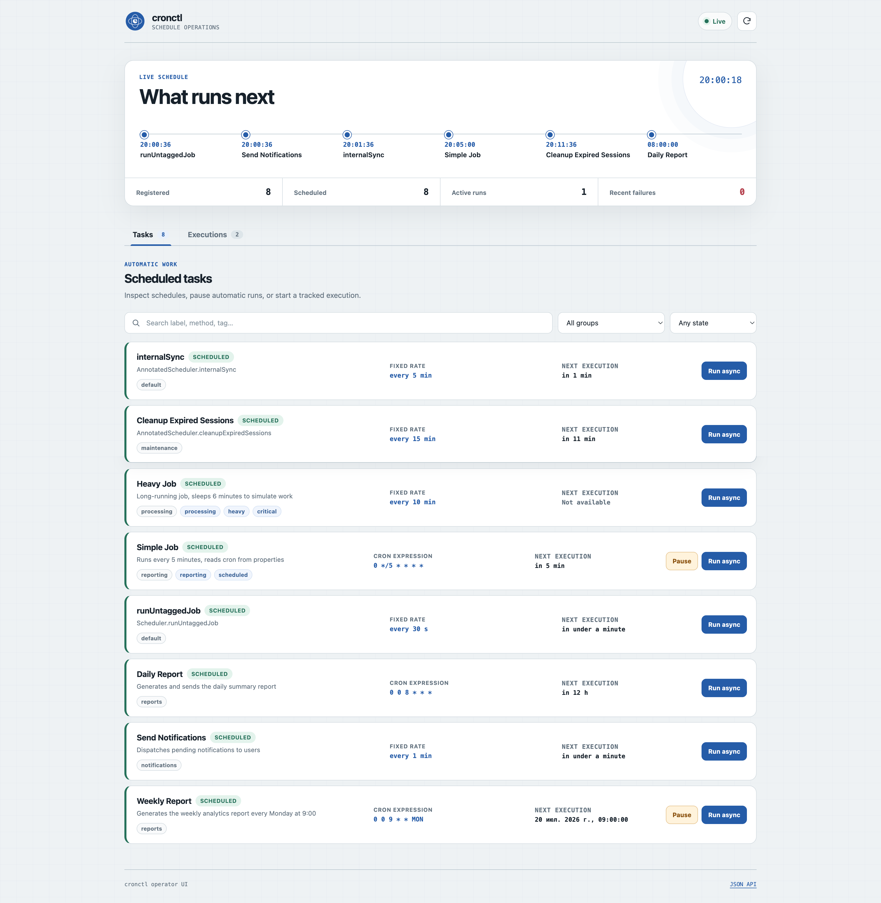

<div style="text-align: center;">
  
  <h1>cronctl-spring-boot-starter</h1>
</div>

**English** | [Русский](README_ru.md)

[](https://central.sonatype.com/artifact/ru.syntezis/cronctl-spring-boot-starter)
[](https://javadoc.io/doc/ru.syntezis/cronctl-spring-boot-starter)
[](https://github.com/syntezis-ru/cronctl/releases/latest)
[](LICENSE)

[](https://openjdk.org/projects/jdk/17/)
[](https://spring.io/projects/spring-boot)

[](https://github.com/syntezis-ru/cronctl/actions/workflows/ci.yml)
[](https://github.com/syntezis-ru/cronctl/actions/workflows/qodana_code_quality.yml)

[](https://github.com/syntezis-ru/cronctl/commits/master)
[](https://github.com/syntezis-ru/cronctl/issues)

A Spring Boot starter that exposes an operator UI and REST API for observing, controlling,
and manually triggering methods annotated with `@Scheduled`.

Add the dependency to your project — cronctl auto-configures itself, scans all
`@Scheduled` beans, and provides HTTP endpoints to inspect, execute, and monitor them on demand.

## Requirements

| Dependency  | Version |
|-------------|---------|
| Java        | 17+     |
| Spring Boot | 3.0.5+ (3.x) |

On Spring Framework 6.0 (Spring Boot 3.0/3.1), task discovery, REST operations, manual
execution history, next-execution calculation, and pause/resume are supported. Native automatic
execution history requires Spring Framework 6.1+; on older versions the task reports
`automatic_tracking_status: UNAVAILABLE` with an explanatory message.

## Installation

cronctl is available on [Maven Central](https://central.sonatype.com/artifact/ru.syntezis/cronctl-spring-boot-starter).
No additional repository configuration is required.

**Maven:**

```xml
<dependency>
    <groupId>ru.syntezis</groupId>
    <artifactId>cronctl-spring-boot-starter</artifactId>
    <version>0.1.0</version>
</dependency>
```

**Gradle:**

```groovy
implementation 'ru.syntezis:cronctl-spring-boot-starter:0.1.0'
```

No additional configuration is required. cronctl registers itself via Spring Boot
auto-configuration as soon as the dependency is on the classpath.

> **Swagger UI**
> Add `org.springdoc:springdoc-openapi-starter-webmvc-ui:2.6.0` to enable OpenAPI
> documentation. cronctl then adds its own group to the existing Swagger UI at
> `/swagger-ui/index.html`. The dependency is optional and is not forced on consumers.

> **Operator UI**
> Add Thymeleaf to enable the task operations dashboard at `/api/cronctl/ui`:
>
> ```xml
> <dependency>
>     <groupId>org.springframework.boot</groupId>
>     <artifactId>spring-boot-starter-thymeleaf</artifactId>
> </dependency>
> ```
>
> Gradle: `implementation 'org.springframework.boot:spring-boot-starter-thymeleaf'`.
> The UI is optional and does not affect the REST API or Swagger when Thymeleaf is absent.

## Quick Start

```java
@SpringBootApplication
@EnableScheduling
public class MyApplication {
    public static void main(String[] args) {
        SpringApplication.run(MyApplication.class, args);
    }
}
```

```java
@Component
public class MyScheduler {

    @CronctlTask(
            id = "integration.sync-data",
            label = "Sync Data",
            description = "Pulls updates from the remote source",
            group = "integration",
            tags = {"sync", "critical"},
            timeout = 30,
            togglingEnabled = true
    )
    @Scheduled(fixedRate = 60_000)
    public void syncData() {
        // ...
    }

    @Scheduled(cron = "0 0 3 * * *")
    public void generateReport() {
        // registered automatically with defaults: label = "generateReport"
    }

    @CronctlTask.Exclude
    @Scheduled(fixedRate = 60_000)
    public void internalJob() {
        // never appears in the API
    }
}
```

After startup, all `@Scheduled` methods are registered automatically.

## @CronctlTask Annotation

`@CronctlTask` is optional. Without it, cronctl registers the method with sensible defaults.
Use it to enrich the API response with human-readable metadata and control execution behaviour.

| Attribute                | Default                    | Description                                                                      |
|--------------------------|----------------------------|----------------------------------------------------------------------------------|
| `id`                     | derived stable key         | Stable task key exposed as `task_key`                                            |
| `label`                  | method name                | Display name shown in the API response                                           |
| `description`            | `ClassName.methodName`     | Human-readable description                                                       |
| `group`                  | `"default"`                | Logical group for categorisation                                                 |
| `tags`                   | `[]`                       | Arbitrary tags for filtering                                                     |
| `timeout`                | `USE_GLOBAL_TIMEOUT` (`0`) | `0` inherits the global timeout, `-1` disables it, a positive value overrides it |
| `timeUnit`               | `SECONDS`                  | Time unit for a positive `timeout`                                               |
| `togglingEnabled`        | `false`                    | Allows automatic scheduling to be paused and resumed through the API             |
| `concurrency`            | `ALLOW`                    | Process-local policy for overlapping automatic and manual executions             |
| `maxConcurrentExecutions`| `1`                        | Positive limit used by `SKIP`, `QUEUE`, and `CANCEL_PREVIOUS`                    |
| `retries`                | `0`                        | Automatic retries after the original failed execution; disabled by default       |
| `retryDelay`              | `"PT1S"`                  | Base ISO-8601 delay between automatic retries                                    |
| `retryBackoff`            | `FIXED`                    | `FIXED` or `EXPONENTIAL` delay strategy                                           |
| `maxRetryDelay`           | `"PT5M"`                  | Maximum delay after backoff and jitter                                             |
| `retryJitter`             | `0.0`                      | Symmetric delay jitter from `0.0` to `1.0`                                        |
| `retryOn`                 | `[]`                       | Retryable exception types; empty means all `Exception` types                      |
| `nonRetryableOn`          | `[]`                       | Exception types that must not be retried; takes precedence                        |

Use the named constants to make the timeout intent explicit:

```java
@CronctlTask(timeout = CronctlTask.USE_GLOBAL_TIMEOUT) // default
@CronctlTask(timeout = CronctlTask.NO_TIMEOUT)
@CronctlTask(timeout = 30, timeUnit = TimeUnit.SECONDS)
```

### Concurrent execution policies

Concurrency policies prevent automatic and manual invocations of the same stable task key from
accidentally overlapping inside one application process:

```java
@CronctlTask(
        id = "catalog.sync",
        concurrency = ConcurrencyPolicy.SKIP,
        maxConcurrentExecutions = 1
)
@Scheduled(cron = "0 */5 * * * *")
public void synchronizeCatalog() {
    // ...
}
```

| Policy            | Behaviour when the limit is reached                                               |
|-------------------|-----------------------------------------------------------------------------------|
| `ALLOW`           | Preserves the existing behaviour and does not enforce the configured limit        |
| `SKIP`            | Records `SKIPPED` with `status_reason=CONCURRENT_EXECUTION`                        |
| `QUEUE`           | Keeps the new execution in `QUEUED` until a fair semaphore permit becomes free    |
| `CANCEL_PREVIOUS` | Interrupts the oldest execution, then waits for it to release its permit           |

The same quota covers `SCHEDULED`, `MANUAL_SYNC`, and `MANUAL_ASYNC` executions. Cancellation
is cooperative through `Thread.interrupt()`: task code must react to interruption. A replacement
never exceeds the configured limit; if the old task ignores interruption, the replacement remains
queued.

This first implementation is local to one application context. It does not coordinate multiple
application instances. A future distributed implementation can integrate with a provider such as
ShedLock; cronctl does not add ShedLock or any database/Redis/Mongo dependency in this release.

### Retry policies

Automatic retries are explicitly opt-in because scheduled methods are not necessarily idempotent:

```java
@CronctlTask(
        id = "catalog.sync",
        retries = 3,
        retryDelay = "PT10S",
        retryBackoff = RetryBackoff.EXPONENTIAL,
        maxRetryDelay = "PT5M",
        retryJitter = 0.2,
        retryOn = {SocketTimeoutException.class, ConnectException.class},
        nonRetryableOn = IllegalArgumentException.class
)
```

`retries = 3` means the original execution plus at most three automatic `RETRY` executions.
Exception filters inspect the complete cause chain; `nonRetryableOn` wins. With an empty
`retryOn`, all `Exception` subclasses are eligible, while `Error` is not retried implicitly.
Only `FAILED` executions trigger policy retries. `TIMED_OUT` executions can still be repeated
explicitly by an operator.

Every retry has its own execution UUID and lifecycle. `parent_execution_id`, `root_execution_id`,
`retry_series_id`, `attempt`, and `retry_trigger` preserve lineage. Automatic retries continue the
current series; a manual Retry starts a new series and a fresh automatic retry budget. Retry
executions use the same timeout, bounded executor, and concurrency policy as every other source.

Queued persistent retries are restored after application restart. A retry whose task key is no
longer registered becomes `SKIPPED` with `status_reason=TASK_NOT_REGISTERED`.

Use `@CronctlTask.Exclude` to prevent a method from appearing in the API at all.
This annotation is respected in `AUTO` and `PACKAGE` scan modes.

### Stable task keys

Task keys remain the same across application restarts. For integrations, dashboards,
and automation, define an explicit key:

```java
@CronctlTask(
        id = "billing.reconciliation",
        label = "Billing reconciliation"
)
@Scheduled(cron = "0 0 2 * * *")
public void reconcileBilling() {
    // ...
}
```

If `id` is blank, cronctl derives the key as:

```text
spring.application.name + "." + beanName + "." + methodSignature
```

For example, `billing-service.reconciliationScheduler.reconcileBilling()`.
When `spring.application.name` is not configured, `application` is used. Explicit IDs
also support Spring property placeholders. Duplicate task keys fail registration at startup.

Task keys are returned as strings in `task_key`. Execution IDs are separate, random UUIDs
generated for every automatic or manual execution.

## Scan Modes

Control which `@Scheduled` methods are registered via `cronctl.scan.type`:

| Mode        | Behaviour                                                                                  |
|-------------|--------------------------------------------------------------------------------------------|
| `AUTO`      | All `@Scheduled` methods, except those annotated with `@CronctlTask.Exclude` **(default)** |
| `ANNOTATED` | Only methods explicitly annotated with `@CronctlTask`                                      |
| `PACKAGE`   | All `@Scheduled` methods in the specified packages, except `@Exclude`                      |

**ANNOTATED mode** — only opt-in methods are registered:

```yaml
cronctl:
  scan:
    type: ANNOTATED
```

**PACKAGE mode** — register only methods in given packages:

```yaml
cronctl:
  scan:
    type: PACKAGE
    base-packages:
      - ru.example.billing
      - ru.example.reporting
```

## Operator UI

When Thymeleaf is present, cronctl exposes an operator dashboard at:

```text
http://localhost:8080/api/cronctl/ui
```

[Open the interactive operator UI demo](https://syntezis-ru.github.io/cronctl/).
The demo uses a simulated scheduler in the browser, so pause, resume, run, and
cancel actions do not invoke server-side jobs.

[](https://syntezis-ru.github.io/cronctl/)

The path follows `cronctl.api.base-path`, so a base path of `/internal/scheduler`
serves the dashboard at `/internal/scheduler/ui`. It uses the same access policy as
the REST API (`cronctl.api.public-access`).

The dashboard provides:

- upcoming execution timeline and task filters;
- schedule metadata, current enabled state, and restrictive concurrency-policy badges;
- confirmed pause with the optional `interrupt` flag and immediate resume;
- confirmed asynchronous manual execution;
- a forensic execution ledger for automatic and manual runs, including source, node,
  planned and actual start, drift, duration, and failure details;
- server-side history filtering and pagination, plus cancellation of manual async runs;
- scheduled-task health: last automatic status, last success, and consecutive failures.

Tasks refresh every 10 seconds. Executions refresh every 2 seconds while work is
pending or running and every 10 seconds otherwise. Polling pauses in a hidden browser tab.

Disable only the operator UI while keeping the API available:

```yaml
cronctl:
  ui:
    enabled: false
```

Swagger UI remains available independently as API documentation.

## API

Base path: `/api/cronctl` (configurable via `cronctl.api.base-path`)

### GET /api/cronctl/tasks

Returns registered `@Scheduled` tasks. Supports optional filtering by `group` and `tag`.
When both parameters are provided, only tasks matching **both** conditions are returned.

| Parameter | Type   | Required | Description                         |
|-----------|--------|----------|-------------------------------------|
| `group`   | string | no       | Return only tasks in this group     |
| `tag`     | string | no       | Return only tasks carrying this tag |

```bash
# All tasks
curl http://localhost:8080/api/cronctl/tasks

# Filter by group
curl http://localhost:8080/api/cronctl/tasks?group=integration

# Filter by tag
curl http://localhost:8080/api/cronctl/tasks?tag=critical

# Filter by both (AND)
curl "http://localhost:8080/api/cronctl/tasks?group=integration&tag=critical"
```

```json
{
  "tasks": [
    {
      "task_key": "integration.sync-data",
      "label": "Sync Data",
      "description": "Pulls updates from the remote source",
      "group": "integration",
      "tags": [
        "sync",
        "critical"
      ],
      "enabled": true,
      "toggling_enabled": true,
      "timeout_seconds": 30,
      "concurrency_policy": "SKIP",
      "max_concurrent_executions": 1,
      "next_execution_at": "2024-05-01T12:01:00Z",
      "automatic_tracking_status": "ACTIVE",
      "automatic_tracking_message": null,
      "scheduled_health": {
        "last_execution_at": "2024-05-01T12:00:00.050Z",
        "last_execution_status": "SUCCEEDED",
        "last_success_at": "2024-05-01T12:00:00.050Z",
        "consecutive_failures": 0
      },
      "details": {
        "method_name": "syncData",
        "schedule": {
          "fixed_rate": 60000,
          "time_unit": "MILLISECONDS"
        }
      }
    }
  ],
  "total": 1
}
```

Only fields that are actually configured appear in `schedule` — unset fields (`cron`, `fixed_delay`, etc.) are omitted
from the response.

`next_execution_at` is an ISO-8601 UTC timestamp of the task's next scheduled run. It can be
`null` while Spring has not exposed a future slot, while the task is running or overdue, or
while it is paused.

`scheduled_health` is calculated exclusively from `SCHEDULED` executions. Manual runs never
reset the failure counter or change the last-success timestamp. `automatic_tracking_status`
is `AMBIGUOUS` when multiple bean instances expose the same declaring class and method; cronctl
then deliberately avoids attributing automatic observations to the wrong stable task key.

### GET /api/cronctl/tasks/{taskKey}/next-execution

Returns the next execution time for a single task.

```bash
curl http://localhost:8080/api/cronctl/tasks/integration.sync-data/next-execution
```

```json
{
  "task_key": "integration.sync-data",
  "next_execution_at": "2024-05-01T12:01:00Z"
}
```

Returns `404` if the task key is unknown. `next_execution_at` is `null` when Spring does not
currently expose a future run.

### POST /api/cronctl/tasks/{taskKey}/disable

Pauses automatic scheduled execution. The task remains registered and can still be triggered manually.
Only tasks declared with `@CronctlTask(togglingEnabled = true)` can be disabled.

```bash
curl -X POST "http://localhost:8080/api/cronctl/tasks/integration.sync-data/disable?interrupt=false"
```

`interrupt` defaults to `false`. A successful request returns the updated task with
`enabled=false`. Returns `404` for an unknown task and `409` when toggling is not allowed.

### POST /api/cronctl/tasks/{taskKey}/enable

Resumes automatic scheduled execution using the original cron, fixed-rate, or fixed-delay configuration.

```bash
curl -X POST http://localhost:8080/api/cronctl/tasks/integration.sync-data/enable
```

A successful request returns the updated task with `enabled=true`. Repeated enable and disable requests are idempotent.

### Execution history and lifecycle

cronctl records native Spring `@Scheduled` invocations and both manual execution modes in
one model. Every record carries an execution source:

| Source         | Meaning                                     |
|----------------|---------------------------------------------|
| `SCHEDULED`    | Invoked automatically by Spring scheduling |
| `MANUAL_SYNC`  | Invoked through the blocking HTTP endpoint  |
| `MANUAL_ASYNC` | Submitted to cronctl's bounded executor     |
| `RETRY`        | Automatic or operator-requested retry       |
| `CATCH_UP`     | Reserved for a future catch-up policy       |

The lifecycle is `CREATED → QUEUED → RUNNING` followed by one terminal status:

| Status      | Description                                                 |
|-------------|-------------------------------------------------------------|
| `CREATED`   | Execution record created                                    |
| `QUEUED`    | Accepted and waiting to start                               |
| `RUNNING`   | Method is executing                                         |
| `SUCCEEDED` | Method returned normally                                    |
| `FAILED`    | Method threw an exception; inspect `error`                   |
| `CANCELLED` | Cancellation or scheduled interruption was requested        |
| `TIMED_OUT` | Async or retry execution exceeded its effective timeout       |
| `SKIPPED`   | Execution did not start; inspect `status_reason`             |

`planned_at` and `start_delay_ms` are populated for automatic runs when Spring exposes an
exact planned slot. They are `null` when that value cannot be determined. `node_id` identifies
the application instance that observed the run.

#### POST /api/cronctl/tasks/{taskKey}/execute

Executes a task synchronously and returns its final unified execution record. The HTTP response
is `200` even when the method fails; inspect `status` and `error`. A concurrency-policy rejection
returns `429` with `status=SKIPPED` and `status_reason=CONCURRENT_EXECUTION`.

```bash
curl -X POST http://localhost:8080/api/cronctl/tasks/integration.sync-data/execute
```

#### POST /api/cronctl/tasks/{taskKey}/execute-async

Queues a manual asynchronous execution and returns `202 Accepted`. Queue rejection returns
`429` with a persisted `SKIPPED` record whose `status_reason` is `QUEUE_REJECTED`. A worker that
encounters a `SKIP` concurrency limit transitions the accepted record to `SKIPPED` with
`status_reason=CONCURRENT_EXECUTION`.

```bash
curl -X POST http://localhost:8080/api/cronctl/tasks/integration.sync-data/execute-async
```

`POST /tasks/{taskKey}/executions` remains as a deprecated alias.

#### Unified execution response

The sync, async submission, status, and history endpoints use the same representation:

```json
{
  "execution_id": "a1b2c3d4-0000-0000-0000-000000000001",
  "task_key": "integration.sync-data",
  "source": "SCHEDULED",
  "status": "SUCCEEDED",
  "node_id": "billing-service-1",
  "created_at": "2024-05-01T12:00:00Z",
  "queued_at": "2024-05-01T12:00:00Z",
  "planned_at": "2024-05-01T12:00:00Z",
  "started_at": "2024-05-01T12:00:00.050Z",
  "finished_at": "2024-05-01T12:00:00.173Z",
  "start_delay_ms": 50,
  "duration_ms": 123,
  "status_reason": null,
  "parent_execution_id": null,
  "root_execution_id": "a1b2c3d4-0000-0000-0000-000000000001",
  "retry_series_id": "a1b2c3d4-0000-0000-0000-000000000001",
  "attempt": 1,
  "retry_trigger": null,
  "retryable": false,
  "error": null
}
```

#### Manual retry

`POST /api/cronctl/executions/{executionId}/retry` creates an immediate retry for a leaf
`FAILED` or `TIMED_OUT` execution and returns `202`. Manual retry remains available when
`retries=0`; the explicit operator action starts a new retry series. A second retry of an
execution that already has a child returns `409`.

`POST /api/cronctl/executions/retry-all-failed` retries at most the newest eligible failure per
registered task. The UI exposes both actions and confirms Retry all before submitting work.

On failure, `error` contains both the exception type and message.

#### GET /api/cronctl/executions/{executionId}

Returns any automatic or manual execution by UUID, or `404` when it is unknown or no longer
retained.

#### DELETE /api/cronctl/executions/{executionId}

Requests interruption of an active `MANUAL_ASYNC` or `RETRY` execution. Returns `204` when
accepted, `409` for another source or a terminal execution, and `404` for an unknown UUID.

#### GET /api/cronctl/executions

Returns newest-first, server-paginated history.

| Parameter | Type    | Default | Description                                      |
|-----------|---------|---------|--------------------------------------------------|
| `taskKey` | string  | —       | Exact stable task key                            |
| `status`  | enum    | —       | Execution status                                 |
| `source`  | enum    | —       | Execution source                                 |
| `nodeId`  | string  | —       | Exact node identifier                            |
| `from`    | instant | —       | Include records created at or after this instant |
| `to`      | instant | —       | Include records created before this instant      |
| `page`    | integer | `0`     | Zero-based page                                  |
| `size`    | integer | `50`    | Page size, capped at `200`                       |

```bash
curl "http://localhost:8080/api/cronctl/executions?source=SCHEDULED&status=FAILED&page=0&size=50"
```

```json
{
  "executions": [],
  "total": 0,
  "page": 0,
  "size": 50,
  "has_next": false
}
```

The default `InMemoryExecutionStore` retains at most 1,000 terminal records. It enforces the
size limit immediately and removes records older than seven days every ten minutes; active
executions are never evicted. Its history is process-local and is lost on restart. Scheduled
health remains available for the process lifetime even after individual records are evicted.
Declare your own `ExecutionStore` bean to replace the default store without changing the
lifecycle or API. A custom store must implement `deleteExpired(Instant threshold)`; cronctl
invokes it on the same retention schedule. cronctl does not yet detect executions missed while
the application was down; `CATCH_UP` remains reserved for a future policy.

Task pause markers use a separate `TaskStateStore` SPI. The default `InMemoryTaskStateStore`
is thread-safe but process-local, so pauses do not survive an application restart. Declare a
custom persistent `TaskStateStore` bean to restore paused tasks at startup. Unknown stored task
keys are retained, while markers for tasks that no longer allow toggling are removed. Manual
sync and async execution remain available while a task is paused. JDBC, Redis, and Mongo store
implementations are not bundled in this release.

## Programmatic Configuration

As an alternative to `application.yml`, you can configure cronctl by declaring a
`CronctlConfiguration` bean. Only fields explicitly set on the builder take effect —
everything else continues to be resolved from `application.yml` and cronctl's built-in defaults.

```java

@Bean
public CronctlConfiguration cronctlConfiguration() {
    return CronctlConfiguration.builder()
            .basePath("/internal/scheduler")
            .scanType(ScanType.ANNOTATED)
            .apiPublicAccess(false)
            .uiEnabled(true)
            .executorThreadPoolSize(8)
            .executorTimeoutSeconds(120)
            .historyMaxEntries(20_000)
            .historyRetention(Duration.ofDays(14))
            .historyCleanupInterval(Duration.ofMinutes(10))
            .historyNodeId("billing-service-1")
            .build();
}
```

All builder fields map directly to their `application.yml` counterparts:

| Builder field            | Equivalent property                 |
|--------------------------|-------------------------------------|
| `basePath`               | `cronctl.api.base-path`             |
| `apiPublicAccess`        | `cronctl.api.public-access`         |
| `swaggerPublicAccess`    | `cronctl.swagger.public-access`     |
| `swaggerGroup`           | `cronctl.swagger.group`             |
| `swaggerPathsToMatch`    | `cronctl.swagger.paths-to-match`    |
| `uiEnabled`              | `cronctl.ui.enabled`                 |
| `scanType`               | `cronctl.scan.type`                 |
| `scanBasePackages`       | `cronctl.scan.base-packages`        |
| `executorThreadPoolSize` | `cronctl.executor.thread-pool-size` |
| `executorQueueCapacity`  | `cronctl.executor.queue-capacity`   |
| `executorTimeoutSeconds` | `cronctl.executor.timeout-seconds`  |
| `historyMaxEntries`      | `cronctl.history.max-entries`       |
| `historyRetention`       | `cronctl.history.retention`         |
| `historyCleanupInterval` | `cronctl.history.cleanup-interval`  |
| `historyNodeId`          | `cronctl.history.node-id`           |

> **Priority**: the programmatic bean takes precedence over `application.yml`, which takes
> precedence over cronctl's built-in defaults.

## Configuration

All properties are optional. The defaults work out of the box.

| Property                            | Default           | Description                                                                                |
|-------------------------------------|-------------------|--------------------------------------------------------------------------------------------|
| `cronctl.enabled`                   | `true`            | Set to `false` to disable the library entirely (no beans registered, no endpoints created) |
| `cronctl.api.base-path`             | `/api/cronctl`    | Base path for all cronctl REST endpoints                                                   |
| `cronctl.api.public-access`         | `true`            | When `false`, authentication is required to call the API                                   |
| `cronctl.swagger.public-access`     | `true`            | When `false`, authentication is required to access Swagger UI                              |
| `cronctl.swagger.group`             | `cronctl`         | Group name shown in Swagger UI                                                             |
| `cronctl.swagger.paths-to-match`    | `/api/cronctl/**` | Path pattern used to include endpoints in the cronctl Swagger group                        |
| `cronctl.ui.enabled`                | `true`            | Expose the operator UI when Thymeleaf is available                                         |
| `cronctl.scan.type`                 | `AUTO`            | Scan mode: `AUTO`, `ANNOTATED`, or `PACKAGE` (see [Scan Modes](#scan-modes))               |
| `cronctl.scan.base-packages`        | `[]`              | Packages to scan in `PACKAGE` mode                                                         |
| `cronctl.executor.thread-pool-size` | `4`               | Number of threads in the async execution pool                                              |
| `cronctl.executor.queue-capacity`   | `100`             | Maximum number of tasks waiting in the submission queue                                    |
| `cronctl.executor.timeout-seconds`  | `60`              | Default async execution timeout in seconds; `0` disables the timeout                       |
| `cronctl.history.max-entries`       | `1000`            | Maximum terminal records retained by the default in-memory store                           |
| `cronctl.history.retention`         | `7d`              | Maximum age of terminal records retained by the default in-memory store                    |
| `cronctl.history.cleanup-interval`  | `10m`             | Interval between background deletion of expired terminal records                           |
| `cronctl.history.node-id`           | derived           | Node ID; falls back to instance ID, `HOSTNAME`, then application name plus process UUID    |

See [`docs/config-examples/`](docs/config-examples/) for ready-to-use configuration files covering
common scenarios: custom paths, secured API, production setup, and more.

## Security

By default, all cronctl endpoints are publicly accessible to simplify getting started.

**To require authentication for the API:**

```yaml
cronctl:
  api:
    public-access: false
```

**To require authentication for Swagger UI:**

```yaml
cronctl:
  swagger:
    public-access: false
```

Authentication is delegated to your application's existing Spring Security configuration.
The operator UI inherits `cronctl.api.public-access`. cronctl registers its own
`SecurityFilterChain` scoped to its endpoints — it does not
interfere with the rest of your application's security.

## Disabling cronctl

To disable cronctl in a specific environment (e.g. production) without removing the dependency:

```yaml
# application-prod.yml
cronctl:
  enabled: false
```

## License

This project is licensed under the [Apache License 2.0](LICENSE).

---

<div style="text-align: center;">
  <a href="https://syntezis.ru">
    
  </a>
  <br/>
  <sub>Built and maintained by <a href="https://syntezis.ru">Syntezis</a></sub>
</div>
